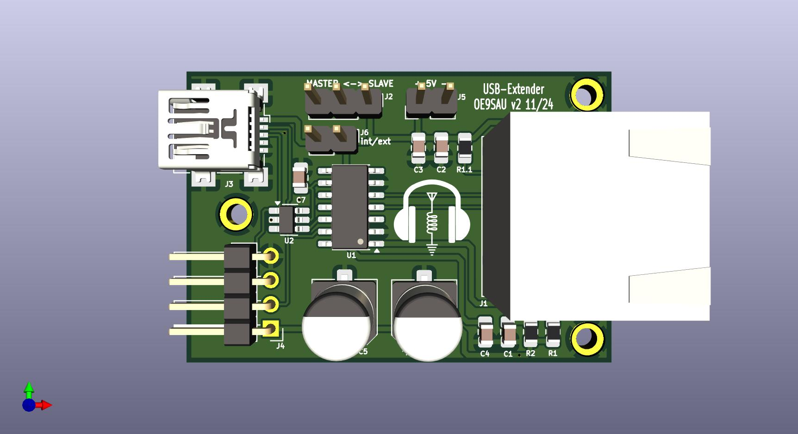

# USB Extender

CH315G is a USB extension control chip, used for USB signal real time transmit and extend transfer distance.
The USB signal extension circuit in the CH315G, support category 5 or category 5 unshielded twisted-pair cables, 
and the transfer distance is no less than 75m of 12Mbps full-speed USB signal, the transfer distance is no less than 300m of 1.5Mbps.

v2: 
* wrong footprint for USBLC6-2 (SOT666->SOT23-6)
* add R1.1 LED choice for RJ45 plug
* wrong marking SLAVE<->MASTER, new: MASTER<->SLAVE
